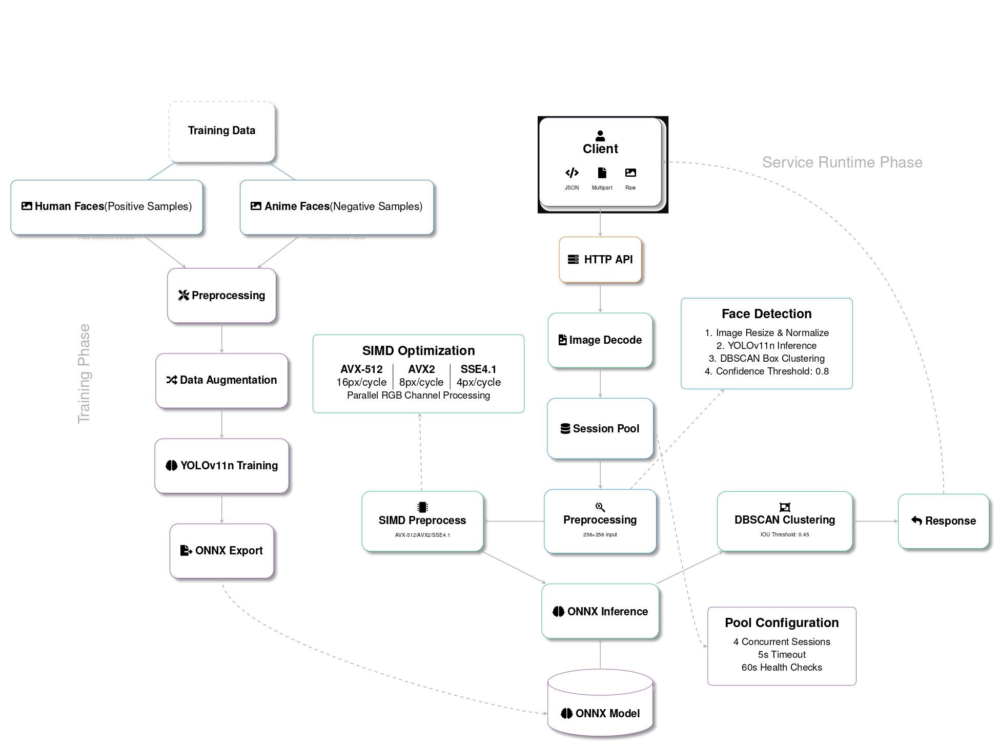

# Face Validation Service



A high-performance face detection and validation service built in Go that uses ONNX Runtime for inference. The service can detect and validate single/multiple faces in images with optimized processing using SIMD instructions.

## Features

- Fast face detection using YOLOv11n model (IR version 9)
- SIMD-optimized image preprocessing (AVX-512, AVX2, SSE4.1)
- Concurrent processing with efficient memory management
- Model session pooling for improved performance
- Support for multiple input formats (JSON, multipart/form-data, raw)
- Health monitoring and metrics endpoints
- Docker support with multi-stage builds
- Graceful shutdown handling

## Tech Stack

- Go 1.22+
- ONNX Runtime 1.20.0
- YOLOv11n neural network model
- SIMD optimizations (AVX-512, AVX2, SSE4.1)
- Docker

## Architecture

### Core Components

1. **Detection Engine**

   - ONNX model inference
   - SIMD-optimized image preprocessing
   - Bounding box processing
   - Clustering algorithm for multiple detections

2. **Session Management**

   - Thread-safe model session pool
   - Automatic session health checks
   - Configurable pool size and timeouts

3. **Image Processing Pipeline**
   - Image decoding
   - Resizing
   - Channel processing
   - SIMD-accelerated preprocessing

### Performance Optimizations

- SIMD instructions for faster image processing
- Concurrent channel processing
- Memory pooling and reuse
- Efficient bounding box clustering
- Session pooling to reduce model loading overhead

## API Endpoints

### POST /validate-face

Validates faces in the provided image.

**Supported Input Formats:**

- JSON with base64 encoded image
- Multipart form-data
- Raw image data

**Response:**

```json
{
    "is_valid": boolean,
    "face_count": integer,
    "message": string
}
```

### GET /health

Health check endpoint.

### GET /metrics

Returns pool metrics and performance statistics.

## Configuration

Environment Variables:

- `PORT`: Server port (default: 8080)
- `DEBUG`: Enable debug logging
- `MODEL_OUTPUT_CHANNELS`: Model output channels
- `MODEL_OUTPUT_GRID_SIZE`: Model output grid size
- `GOMAXPROCS`: Go runtime thread limit
- `GOMEMLIMIT`: Go runtime memory limit

## Installation

### Using Docker

```bash
# Build the image
docker build -t face-validation-service .

# Run the container
docker run -p 8080:8080 face-validation-service
```

### Manual Installation

Requirements:

- Go 1.22+
- ONNX Runtime 1.20.0
- C compiler (for CGO)

```bash
# Clone the repository
git clone https://github.com/Tutortoise/face-validation-service

# Build the service
cd face-validation-service/web
go build -o server

# Run the service
./server
```

## Performance Considerations

- Uses SIMD instructions when available
- Implements memory pooling to reduce GC pressure
- Concurrent processing of image channels
- Session pooling for better resource utilization
- Efficient clustering algorithm for multiple face detection

## Monitoring and Metrics

The service provides monitoring endpoints for:

- Session pool statistics
- Processing times
- Resource usage
- Error rates
- Health status

## Error Handling

The service implements comprehensive error handling for:

- Invalid input formats
- Image decoding failures
- Model inference errors
- Resource exhaustion
- Timeout scenarios

## Development

### Project Structure

```
face-validation-service/
├── web/
│   ├── clustering/      # Clustering algorithms
│   ├── detections/      # Face detection logic
│   ├── lib/            # ONNX Runtime libraries
│   ├── models/         # Data models
│   ├── onnx_model/     # Neural network model
│   ├── main.go         # Main application
│   └── pool.go         # Session pool implementation
└── Dockerfile
```

### Building for Development

```bash
# Run tests
go test ./...

# Build with debug info
go build -gcflags="all=-N -l" -o server

# Run with debug logging
DEBUG=true ./server
```

## Model Training

The face detection model was trained using two datasets to ensure accurate detection of human faces while eliminating false positives:

1. **Main Face Detection Dataset**

   - Source: [Face Detection Dataset](https://www.kaggle.com/datasets/fareselmenshawii/face-detection-dataset/data) from Kaggle
   - Purpose: Primary training data for human face detection
   - Features:
     - High-quality human face images
     - Various poses and lighting conditions
     - Different age groups and ethnicities

2. **Anime Face Dataset (Negative Examples)**
   - Source: [Annotated Anime Faces Dataset](https://www.kaggle.com/datasets/andy8744/annotated-anime-faces-dataset)
   - Purpose: Used as negative examples to reduce false positives
   - Features:
     - Anime and cartoon-style faces
     - Helps model discriminate between real human faces and illustrated faces
     - Improves model's specificity for human face detection

### Training Process

1. **Data Preparation**

   - Combined both datasets with appropriate labeling
   - Human faces labeled as positive examples
   - Anime faces labeled as negative examples
   - Applied data augmentation techniques

2. **Model Architecture**

   - Based on YOLOv11n with IR version 9
   - Optimized for 256x256 input resolution
   - Modified to handle binary classification (human face vs. non-human face)

3. **Training Configuration**
   - Trained on Kaggle's GPU environment
   - Used transfer learning from pre-trained weights
   - Implemented custom loss function to balance precision and recall
   - Employed hard negative mining to improve discrimination capability

This dual-dataset approach ensures the model:

- Accurately detects human faces
- Minimizes false positives from animated or illustrated faces
- Provides robust performance in real-world applications
